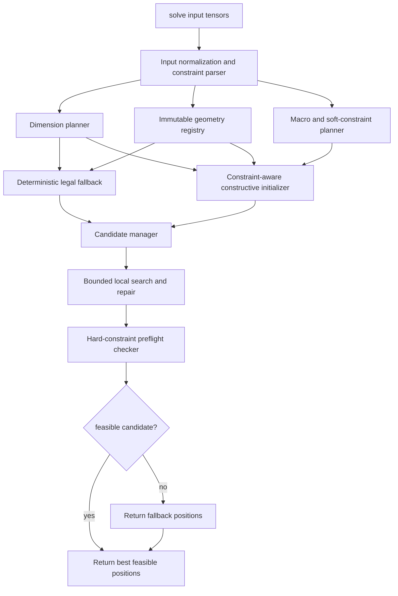

# High-Level Design

## Overview

This document defines the high-level architecture for a contest-compliant FloorSet optimizer for the ICCAD 2026 FloorSet Challenge. The design targets a copied contestant optimizer file, initially `iccad2026contest/my_optimizer.py`, that implements `solve()` and returns one `(x, y, width, height)` tuple per active block.

The proposed architecture is a hybrid heuristic solver with three layers:

1. A deterministic legal fallback that prioritizes hard-constraint feasibility.
2. A constraint-aware constructive initializer that handles immutable blocks, soft block dimensions, boundary requests, MIB groups, grouping clusters, and preplaced obstacles.
3. A bounded local search layer that refines feasible or repairable candidates while retaining the best feasible result.

An ML-guided initializer remains an optional extension only if training data access and final packaging rules allow model artifacts. It is not part of the correctness-critical path.

Primary sources: `doc/proposal.md` (primary authority), `doc/problem-brief.md`, `doc/repo-map.md`, `doc/quality-gates.md`, `iccad2026contest/README.md`, `iccad2026contest/FloorplanningContest_ICCAD_2026_v10.pdf`, and `iccad2026contest/iccad2026_evaluate.py`.

## Goals

- Return a valid contest output from `solve()` with exactly `block_count` `(x, y, width, height)` tuples.
- Preserve all hard constraints before optimizing score:
  - no overlaps;
  - soft block area within 1% of target area;
  - fixed-shape dimensions exactly match evaluator target dimensions;
  - preplaced location and dimensions exactly match evaluator target values.
- Improve practical contest score through lower HPWL, lower bounding-box area, fewer soft constraint violations, and bounded runtime.
- Handle soft constraints for boundary, grouping, and MIB where doing so does not compromise hard feasibility.
- Keep implementation work isolated in a copied optimizer file unless final contest packaging rules justify helper files.
- Avoid dependence on training data, generated artifacts, or model weights for correctness.

## Non-Goals

- Do not modify the evaluator, dataset loaders, validation data, or `optimizer_template.py` as part of the initial solver architecture.
- Do not rely on reverse-engineering the dataset generator.
- Do not make an ML-only solver that can return infeasible outputs without deterministic legalization.
- Do not introduce new services, queues, databases, external APIs, or deployment infrastructure.
- Do not specify final submission packaging beyond what is confirmed by contest README/PDF/evaluator behavior.
- Do not track generated result files, logs, caches, local datasets, or downloaded training data as part of the design.

## Requirements Summary

| Category | Requirement | Source Traceability |
| --- | --- | --- |
| Optimizer interface | The evaluator loads an optimizer Python file, finds an optimizer class, and calls `solve(block_count, area_targets, b2b_connectivity, p2b_connectivity, pins_pos, constraints, target_positions)`. | `doc/proposal.md` Current Project State; `doc/problem-brief.md` Required Inputs; evaluator `FloorplanOptimizer.solve()` |
| Output | Return a list of exactly `block_count` tuples `(x, y, width, height)` using lower-left coordinates and rectangular dimensions. | `doc/problem-brief.md` Required Outputs; PDF Expected Output |
| Hard feasibility | Overlap, soft-block area, fixed-shape dimensions, and preplaced position/dimensions are hard constraints. Any violation gives cost `10.0`. | `doc/proposal.md` Constraints; PDF Problem Statement and Objective Function; README Scoring |
| Soft constraints | Boundary, grouping, and MIB violations increase cost but do not make a solution infeasible. | `doc/problem-brief.md` Constraints; README Constraint Relaxations |
| Scoring | Feasible cost is capped below `10.0`; quality uses HPWL gap, area gap, soft violation factor, and runtime factor. Local runtime factor is neutral. | `doc/problem-brief.md` Evaluation Criteria; README Scoring; evaluator `compute_cost()` |
| Data scale | Cases have 21 to 120 blocks; validation and hidden test each have 100 cases. Larger block counts dominate final score through `exp(n / 12)` weighting. | `doc/proposal.md` Problem Summary; PDF Total Score; README Scoring |
| Workflow | Ask before installing, downloading, evaluating, training, visualizing, or writing generated outputs. | `doc/quality-gates.md`; repository instructions |

## Proposed Architecture

The architecture is a single optimizer entry point with logical modules. These modules may be implemented as helper functions or internal classes inside `iccad2026contest/my_optimizer.py`; they are not separate files unless packaging rules are later confirmed.



Architectural decisions:

- Treat the deterministic legal fallback as mandatory and correctness-critical.
- Treat constructive placement and local search as quality layers that must never discard the best known feasible candidate.
- Treat fixed-shape and preplaced target data as immutable input facts owned by the geometry and dimension planning modules.
- Use raw HPWL, bounding-box area, soft violation counts, and hard infeasibility barriers as online optimization proxies because official baseline gaps are not passed into `solve()`.
- Keep ML output, if added later, as candidate seed data that must pass through the same legalizer and preflight checks as heuristic candidates.

## Modules

| Module | Responsibility | Inputs | Outputs and Owned Data | Dependencies | Externally Visible Behavior | Source Traceability |
| --- | --- | --- | --- | --- | --- | --- |
| Optimizer Entry | Provide the evaluator-facing optimizer class and `solve()` method. Orchestrate parsing, construction, search, fallback, and final return. | Evaluator tensors and `block_count`. | Final list of block tuples; per-call runtime budget. | All internal modules. | Only visible contract is `solve()` output. | `doc/proposal.md` Objective and Current Project State; evaluator interface |
| Input Normalization and Constraint Parser | Slice active blocks, normalize tensor/list values, and derive block sets for fixed, preplaced, MIB, grouping, and boundary constraints. | `area_targets`, connectivity, pins, `constraints`, `target_positions`. | Constraint model with active block ids, group ids, boundary bitmasks, and connectivity views. | Optimizer Entry. | No direct external output; feeds all downstream modules. | `doc/proposal.md` Algorithm Strategy; `doc/problem-brief.md` Required Inputs |
| Immutable Geometry Registry | Preserve exact fixed-shape and preplaced target dimensions and preplaced coordinates. Represent preplaced blocks as placement obstacles. | Constraint model and `target_positions`. | Immutable rectangle records and obstacle set. | Input Parser. | Ensures returned fixed/preplaced rectangles match evaluator targets. | PDF Hard Constraints; README Scoring; evaluator hard checks |
| Dimension Planner | Assign dimensions before placement, preserving immutable dimensions and selecting area-preserving soft-block dimensions. Coordinate compatible MIB group dimensions when feasible. | Area targets, immutable geometry, MIB groups. | Planned `(width, height)` per block; MIB compatibility notes. | Input Parser; Immutable Geometry Registry. | Indirectly visible through output dimensions. | `doc/proposal.md` Intended Optimized Method; `doc/problem-brief.md` Constraints |
| Deterministic Legal Fallback | Produce a simple non-overlapping layout that can be returned when optimized candidates fail preflight. | Planned dimensions and preplaced obstacles. | Fallback candidate positions. | Dimension Planner; Immutable Geometry Registry. | Provides last-resort feasible output when inputs are internally consistent. | `doc/proposal.md` Baseline Method and Correctness Strategy |
| Macro and Soft-Constraint Planner | Build high-level placement units for grouping clusters, MIB-linked shape groups, and boundary-constrained blocks. | Constraint model and planned dimensions. | Macro/unit descriptions and boundary placement intents. | Input Parser; Dimension Planner. | No direct external output; affects candidate layout. | `doc/proposal.md` Intended Optimized Method; PDF soft constraints |
| Constraint-Aware Constructive Initializer | Generate candidate layouts better than the fallback by placing immutable obstacles, boundary units, grouped macros, and remaining blocks. | Planned dimensions, obstacles, macro/unit descriptions, connectivity. | One or more candidate layouts. | Dimension Planner; Immutable Geometry Registry; Macro Planner. | Produces candidate positions for refinement. | `doc/proposal.md` Proposed Approach and Intended Optimized Method |
| Candidate Manager | Track all candidate layouts, retain the best feasible candidate, and prevent a later failed move from replacing a valid result. | Fallback candidate, constructed candidates, local-search outputs. | Best feasible candidate and candidate score metadata. | Constructive Initializer; Preflight Checker; Proxy Scoring. | Controls final candidate returned by Optimizer Entry. | `doc/proposal.md` Intended Optimized Method and Correctness Strategy |
| Local Search and Repair | Apply bounded, repairable moves such as order swaps, macro movement, area-preserving aspect updates, boundary snapping, MIB synchronization, and compaction. | Candidate layouts, constraints, runtime budget. | Refined candidates and best local states. | Candidate Manager; Proxy Scoring; Preflight Checker. | No direct external output; improves returned candidate quality. | `doc/proposal.md` Intended Optimized Method and Performance Strategy |
| Proxy Scoring | Estimate candidate quality during search using raw HPWL, bounding-box area, soft constraint penalties, and hard infeasibility barriers. | Candidate positions, connectivity, pins, constraints. | Comparable candidate scores for online decisions. | Input Parser; geometry helpers. | No direct external output; ranking affects final output. | `doc/proposal.md` Intended Optimized Method; PDF Objective Function |
| Hard-Constraint Preflight Checker | Mirror evaluator hard checks before final return: positive finite dimensions, overlap-free placement, soft-block area tolerance, immutable fixed/preplaced geometry. | Candidate positions, area targets, constraints, `target_positions`. | Feasibility verdict and violation diagnostics. | Immutable Geometry Registry; Dimension Planner. | Blocks infeasible optimized candidates from being returned when fallback is available. | `doc/proposal.md` Correctness Strategy; evaluator hard constraint checks |
| Optional ML Initializer | Predict initial centers, order, or aspect ratios from contest features, then hand predictions to the legalizer. | Training-derived model output, areas, connectivity, pins, constraints. | Candidate seed only; no authoritative geometry. | Constructive Initializer; Preflight Checker. | None unless packaging and weights are approved. | `doc/proposal.md` Optional ML-Guided Initializer; PDF Motivation |

## Module Relationships

| Type | Source Module | Target Module | Confirmed Source Fact or Open Item | Direction and Ownership | Data or Contract |
| --- | --- | --- | --- | --- | --- |
| Call | Optimizer Entry | Input Normalization and Constraint Parser | Evaluator calls `solve()` with tensors and constraints. | Entry owns call order. | Active input model. |
| Data flow | Constraint Parser | Dimension Planner | Constraints identify fixed/preplaced/MIB/boundary/grouping columns. | Parser produces, planner consumes. | Block sets, group ids, boundary bitmasks. |
| Ownership | Immutable Geometry Registry | Dimension Planner and Fallback | Fixed/preplaced dimensions and preplaced positions are immutable. | Registry owns authoritative immutable geometry. | Exact target `(x, y, w, h)` or `(w, h)` values. |
| Lifecycle order | Dimension Planner | Fallback and Constructive Initializer | Dimensions are chosen before placement in the proposed algorithm. | Planner output must exist before packing. | Planned dimensions per active block. |
| Data flow | Macro and Soft-Constraint Planner | Constructive Initializer | Grouping, MIB, and boundary are soft constraints that should shape construction. | Macro planner owns unit intent; initializer places units. | Macro/unit descriptions and edge intents. |
| Call | Constructive Initializer | Candidate Manager | Multi-start solver keeps candidates. | Initializer proposes; manager accepts and ranks. | Candidate layouts. |
| Call | Candidate Manager | Local Search and Repair | Bounded local search refines candidates and returns best feasible state. | Manager owns retention; search owns mutations. | Candidate states and move results. |
| Evaluator/test dependency | Hard-Constraint Preflight Checker | Candidate Manager | Any hard violation makes cost `10.0`; any feasible result is capped below `10.0`. | Preflight gates candidate eligibility. | Feasibility verdict and diagnostics. |
| Configuration dependency | Optimizer Entry | Local Search and Repair | Runtime should be bounded and scaled by block count. | Entry sets budget; search consumes budget. | Iteration or time budget by `block_count`. |
| Persistence dependency | All modules | None | Proposal does not require persistent state or generated artifacts. | No module owns persisted output. | In-memory per-case data only. |
| Optional data flow | Optional ML Initializer | Constructive Initializer | ML initializer is allowed only after data access and packaging are resolved. | Optional ML module proposes seeds only. | Predicted seed order, centers, or aspects. Open packaging rules. |

## Data Flow

1. The evaluator imports the optimizer file, instantiates the optimizer class, and calls `solve()` for one case.
2. The optimizer entry slices active block data using `block_count` and passes it to the parser.
3. The parser derives active constraints:
   - fixed-shape blocks;
   - preplaced blocks;
   - MIB group ids;
   - grouping or cluster group ids;
   - boundary bitmasks.
4. The immutable geometry registry extracts exact fixed/preplaced geometry from `target_positions`.
5. The dimension planner assigns dimensions:
   - fixed/preplaced dimensions come from the immutable registry;
   - ordinary soft blocks receive area-preserving dimensions;
   - compatible MIB groups share dimensions where this does not break hard area feasibility.
6. The fallback packer creates a guaranteed non-overlapping candidate using planned dimensions and preplaced obstacles.
7. The macro and soft-constraint planner identifies grouped units and boundary placement intents.
8. The constructive initializer generates one or more candidates using the planned dimensions, obstacles, macro units, boundary intents, and connectivity.
9. The candidate manager evaluates candidates with proxy scoring and hard preflight checks, retaining the best feasible candidate.
10. Local search performs bounded repairable moves, updates proxy scores, and sends candidate states back through preflight.
11. The final return is the best feasible candidate if one exists; otherwise the deterministic fallback is returned.

## Interfaces and Contracts

### Optimizer Contract

The optimizer must expose a class discoverable by `iccad2026_evaluate.py` and implement:

```python
solve(
    block_count,
    area_targets,
    b2b_connectivity,
    p2b_connectivity,
    pins_pos,
    constraints,
    target_positions=None,
)
```

The return value must be a Python list with exactly `block_count` entries. Each entry must be tuple-like and contain finite numeric `(x, y, width, height)` values with positive dimensions.

### Geometry Contract

- Rectangle `i` occupies `[x_i, x_i + w_i] x [y_i, y_i + h_i]`.
- Edge-touching is allowed; positive-area intersection is not allowed.
- Fixed-shape block dimensions must match target width and height.
- Preplaced blocks must match target x, y, width, and height.
- Soft block area must remain within 1% relative error of `area_targets[i]`.

### Candidate Contract

Each candidate layout must retain block ordering by original block id. Modules may use internal unit or macro representations, but they must expand back to one rectangle per block before scoring, preflight, or return.

### Scoring Proxy Contract

The online score is not the official cost because baseline HPWL/area values and official runtime medians are not passed into `solve()`. Proxy scoring may rank candidates by raw weighted HPWL, bounding-box area, soft violation estimates, and hard infeasibility barriers. Final validity remains controlled by the hard-constraint preflight checker.

### Optional ML Contract

Any ML model output is advisory. It may seed construction, ordering, centers, or aspect ratios, but deterministic dimension planning, legalization, and preflight remain mandatory.

## Operational Considerations

- The initial implementation should be self-contained in `iccad2026contest/my_optimizer.py` to match the proposal and repository guidance.
- Contest commands run from `iccad2026contest/`. Evaluation, validation, baseline generation, visualization, training, and dependency installation require explicit approval because they may write files, load datasets, download data, or run for a long time.
- Local validation data is reported present under `LiteTensorDataTest/`, but data loader code can auto-download if data is missing. Commands that instantiate loaders should be treated as data-access operations.
- Runtime budgets should scale with `block_count`; large cases deserve attention because final total score weights larger instances more heavily.
- The local evaluator sets `RuntimeFactor = 1.0`, so local score primarily reflects feasibility, layout quality, and soft violations. Official runtime behavior must still be tracked separately during implementation.
- Generated result JSON files, solution JSON files, visualizations, logs, caches, and datasets should remain local artifacts unless explicitly requested for version control.

## Testing and Quality Gate Alignment

No conventional unit-test runner was discovered. Testing should therefore combine focused synthetic fixtures with the contest validation/evaluation commands listed in `doc/quality-gates.md`.

Recommended synthetic fixtures before contest evaluation:

- all-soft 2 to 5 block cases for area preservation and non-overlap;
- fixed-shape cases for exact width/height preservation;
- preplaced cases for exact position/dimensions and obstacle avoidance;
- boundary edge and corner cases for final bounding-box contact;
- compatible and incompatible MIB cases for hard-feasibility priority;
- grouping cases for edge-sharing connected components;
- 120-block stress cases for runtime and non-overlap.

Contest gates, to run only with user approval:

```bash
cd iccad2026contest
python iccad2026_evaluate.py --validate my_optimizer.py
python iccad2026_evaluate.py --evaluate my_optimizer.py --test-id 0
python iccad2026_evaluate.py --evaluate my_optimizer.py
```

Quality acceptance targets from the proposal:

- `--validate` passes.
- All 100 local validation cases are feasible.
- No overlaps, no fixed/preplaced immutability violations, and no soft-block area violations.
- Runtime remains bounded on large cases.
- Local total score improves over the deterministic fallback and template baseline.

## Risks and Tradeoffs

- A simple fallback maximizes feasibility confidence but may produce poor HPWL and bounding-box area.
- Aggressive soft-constraint repair can increase HPWL or area; hard feasibility must remain the priority.
- MIB constraints can conflict with distinct hard area targets. In such cases, preserving hard feasibility and accepting a soft violation is preferred.
- Boundary constraints are sensitive to final bounding-box edges; compaction or local movement can accidentally invalidate edge or corner contact.
- Local runtime scoring is neutral, while official runtime scoring is cross-submission and per-case. Local score alone cannot confirm runtime competitiveness.
- A single-file optimizer is safest for unknown packaging, but it may become harder to maintain if the solver grows. Helper modules remain an open packaging question.
- Optional ML can improve seeds, but data access, model-weight packaging, and hidden-case generalization are unresolved.

## Assumptions

- Logical modules in this HLD can be implemented inside a single copied optimizer file unless final contest packaging rules allow multiple files.
- `target_positions` is available to the optimizer as described in the proposal and evaluator.
- Hidden test cases follow the validation format and 21 to 120 block range described in the contest docs.
- Fixed/preplaced target data provided by the evaluator is internally consistent unless a validation case is malformed.
- Exact evaluator tolerances should be matched by implementation-time preflight checks.
- The first implementation path is heuristic/legalization first; ML guidance is optional and later.

## Open Questions

- What final submission packaging is allowed beyond an optimizer Python file?
- Are helper modules allowed, or should the implementation remain strictly single-file?
- Are model weights allowed in the final submission, and if so, what size and path constraints apply?
- Is the full training dataset mounted in this workspace, only available on the lab server, or accessible through another approved workflow?
- What official runtime target is acceptable for large hidden cases relative to expected competitor submissions?
- If contest documentation and evaluator behavior disagree during implementation, which source should be treated as authoritative for the specific conflict?
